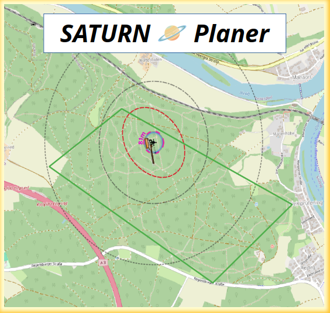

# SATURN Planer

## Überblick
SATURN steht für Semi-Automated TURbiNen und ist ein Werkzeug auf auf Basis einer SQLite Datenbank, um eine Windparkplanung zu erstellen. Das Repository enthält alle Bausteine zur Erstellung eines Geopackages und einer QGIS Projekt Datei und dient der Quellcodeoffenen Dokumentation. Unter Releases kann die aktuelle Version des SATURN Planers heruntergeladen werden.

### Anleitung SATURN Planer
Eine Anleitung zur Nutzung des SATURN Planers ist unter dem [Quickguide](https://github.com/VEB-NullEins/SATURN_Planer/blob/main/doc/QUICKGUIDE.md) zu finden.

