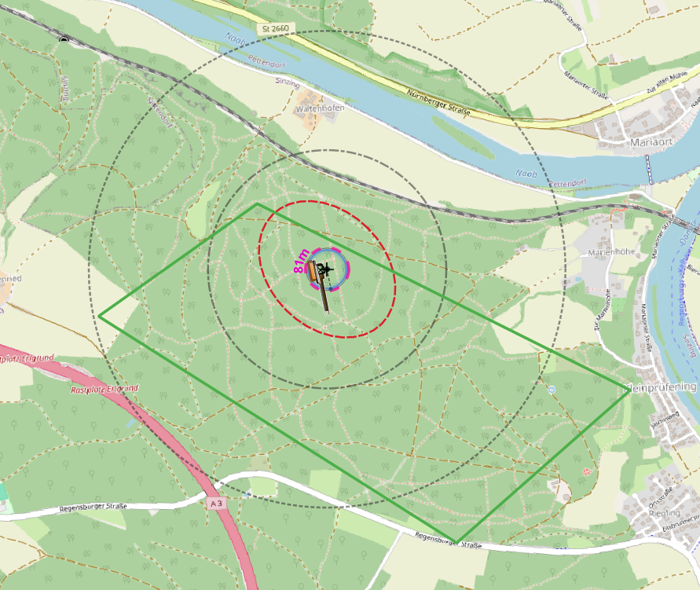

# SATURN Planer

## Überblick
SATURN steht für **S**emi-**A**utomated **TUR**bi**N**en und ist ein Werkzeug auf Basis einer SQLite Datenbank, um eine **Windparkplanung in QGIS zu erstellen**. 

Das Repository enthält alle Bausteine zur Erstellung eines Geopackages und einer QGIS Projekt Datei und dient der quellcodeoffenen Dokumentation. 

## Download und Quickguide
Unter [Releases](https://github.com/VEB-NullEins/SATURN_Planer/releases) kann die aktuelle Version des SATURN Planers heruntergeladen werden. Eine Anleitung zur direkten Nutzung des SATURN Planers ist unter dem [Quickguide](https://github.com/VEB-NullEins/SATURN_Planer/blob/main/docs/QUICKGUIDE.md) zu finden.

## Funktionsweise und Beispiel

Screenshot von einer Beispielplanung.
Legende:

| Symbol           | Entsprechung         |
| ---------------- | -------------------- |
| grau             | benutzerdef. Abstände|
| blau             | Rotor                |
| pink             | Baulastradius        |
| rot              | Turbulenzellipse     |
| orange, braun    | Kranstellfläche      |