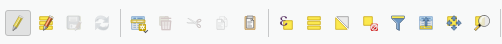

# Quickguide

## Kurzeinleitung
Im Wesentlichen werden drei Komponenten automatisch kalkuliert: 
- Standort der Anlage
- Kranstellfläche
- eine Reihe von relevanten Abstandskreisen

 Die Kalkulation findet auf Basis von Angaben über das jeweilige Projektgebiet (Hauptwindrichtung, Baulastregel, Abstände…) statt. Mithilfe von einfacher Linienausrichtung oder dem Nachzeichnen eines Weges kann eine oder mehrere Anlagen dann im Projektgebiet platziert werden.

 ## Voraussetzungen
 QGIS 3 muss bereits installiert sein. Für die Nutzung des SATURN Planer sind zudem folgende QGIS Kenntnisse hilfreich:
- Bedienung des Datenquellenmanagers oder des Datenbrowsers
- Layer Anzeige
- Editing Modus für Layer aktivieren und Feature hinzufügen oder bearbeiten
- Attributtabelle aufrufen und bearbeiten

## Schritt-für-Schritt Anleitung
### Öffnen des SATURN Planers aus Geopackage
→ QGIS starten

→ Über Menüleiste: Projekt>Öffnen aus>Geopackage

→ Bei Verbindung den Pfad bis zum Geopackage „SATURN_Planer.gpkg“ durchklicken

→ OK klicken

---
### Erstellen einer Windparkkonfiguration
#### Schritt 1: Basis – Projektgebiet erstellen

→ Layer „Basis – Projektgebiet“ anklicken 

→ Editiermodus aktivieren

→ Polygon Feature hinzufügen

→ Projektgebiet zeichnen und mit Rechtsklick abschließen:

→ Projektangaben machen:

→ Mit „OK“ bestätigen

→ Wichtig: Speichern des Layer Edits!

#### Schritt 2: Windparklayout erstellen

#### - _Option 1: WEA Linienausrichtung_
 
→ Layer „Option 1 – WEA Linienausrichtung“ auswählen

→ Editiermodus aktivieren und Linienobjekt hinzufügen

→ Linie einzeichnen (1. Punkt Anlagenmittelpunkt/ 2. Punkt Kranausrichtung)

→ mit OK bestätigen

→ Vorschau der Anlage erscheint

→ Wichtig: Speichern

→ Kranstellfläche, Mittelpunkt und Abstände werden kalkuliert

#### - _Option 2: WEA Wegausrichtung_

→ Layer „Option 1 – WEA Linienausrichtung“ auswählen

→ Editiermodus aktivieren und Linienobjekt hinzufügen

→ Linie mit zwei Punkten entlang Weg zeichnen (1. Punkt Höhe Anlagenstandort)

→ Formular ausfüllen: Wegseite Kranausleger bedeutet entlang des Linienverlaufs wird die Anlage rechts oder links platziert

→ mit OK bestätigen

→ Wichtig: Speichern

→ Kranstellfläche, Mittelpunkt und Abstände werden kalkuliert

### Windparkkonfiguration anpassen

→ Layer „Option 1 – …“ oder „Option 2 – ...“ auswählen je nach Ursprung

→ Editiermodus aktivieren und Stützpunktwerkzeug auswählen

→ Stützpunkt/Vertex auswählen und auf neue Position schieben

→ Wichtig: Speichern

→ Kranstellfläche, Mittelpunkt und Abstände werden neu kalkuliert

---
### Anlagen löschen
→ Layer „Standort WEA“ wählen

→ Editiermodus aktivieren

→ Objekt über Rechteck auswählen

→ Anlagenmittelpunkt auswählen (erscheint danach gelb)

→ Auswahl löschen
 
 

→ Wichtig: Speichern

→ Anlage wird gelöscht

---
### Versionsplanung
→ Layer „Basis – Projektgebiet“ anklicken 

→ Rechtsklick und Attributtabelle öffnen

→ Editiermodus aktivieren

→ In der Tabelle „Planungsversion“ eine andere Version auswählen

→ mit Enter bestätigen
→ wichtig: Speichern!

→ neue Planungsversion wurde ausgewählt und kann beplant werden
→ weitere Vorgaben können für die Version angepasst werden zum Beispiel anderer Anlagentyp oder andere Baulastregeln
→ um zu einer bereits vorhandenen Planungsversion zurückzukehren muss diese einfach wieder in der Attributtabelle ausgewählt werden und die Tabelle gespeichert werden (siehe oben)
